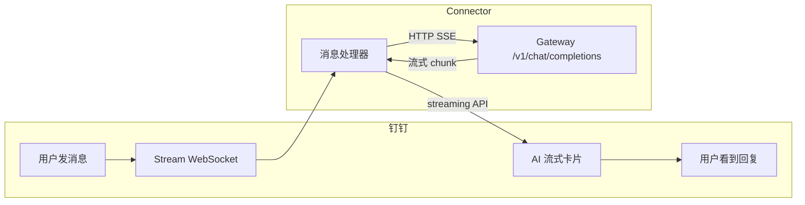

# DingTalk OpenClaw Connector

将钉钉机器人连接到 [OpenClaw](https://openclaw.ai) Gateway，支持 AI Card 流式响应和会话管理。

## 特性

- ✅ **AI Card 流式响应** - 打字机效果，实时显示 AI 回复
- ✅ **会话持久化** - 同一用户的多轮对话共享上下文
- ✅ **超时自动新会话** - 默认 30 分钟无活动自动开启新对话
- ✅ **手动新会话** - 发送 `/new` 或 `新会话` 清空对话历史
- ✅ **图片自动上传** - 本地图片路径自动上传到钉钉

## 架构



## 效果


## 安装

### 1. 安装插件

```bash
# 远程安装
openclaw plugins install https://github.com/DingTalk-Real-AI/dingtalk-moltbot-connector.git

# 升级插件
openclaw plugins update dingtalk-connector

# 或本地开发模式
git clone https://github.com/DingTalk-Real-AI/dingtalk-moltbot-connector.git
cd dingtalk-moltbot-connector
npm install
openclaw plugins install -l .
```

> **⚠️ 旧版本升级提示：** 如果你之前安装过旧版本的 Clawdbot/Moltbot 或 0.4.0 以下版本的 connector 插件，可能会出现兼容性问题，请参考 [Q: 升级后出现插件加载异常或配置不生效](#q-升级后出现插件加载异常或配置不生效)。

### 2. 配置

在 `~/.openclaw/openclaw.json` 中添加：

```json5
{
  "channels": {
    "dingtalk-connector": {
      "enabled": true,
      "clientId": "dingxxxxxxxxx",       // 钉钉 AppKey
      "clientSecret": "your_secret_here", // 钉钉 AppSecret
      "gatewayToken": "",                 // 可选：Gateway 认证 token, opencode.json配置中 gateway.auth.token 的值 
      "gatewayPassword": "",              // 可选：Gateway 认证 password（与 token 二选一）
      "sessionTimeout": 1800000           // 可选：会话超时(ms)，默认 30 分钟
    }
  },
  "gateway": { // gateway通常是已有的节点，配置时注意把http部分追加到已有节点下
    "http": {
      "endpoints": {
        "chatCompletions": {
          "enabled": true
        }
      }
    }
  }
}
```

或者在 OpenClaw Dashboard 页面配置：


### 3. 重启 Gateway

```bash
openclaw gateway restart
```

验证：

```bash
openclaw plugins list  # 确认 dingtalk-connector 已加载
```

## 创建钉钉机器人

1. 打开 [钉钉开放平台](https://open.dingtalk.com/)
2. 进入 **应用开发** → **企业内部开发** → 创建应用
3. 添加 **机器人** 能力，消息接收模式选择 **Stream 模式**
4. 开通权限：
   - `Card.Streaming.Write`
   - `Card.Instance.Write`
   - `qyapi_robot_sendmsg`
5. **发布应用**，记录 **AppKey** 和 **AppSecret**

## 配置参考

| 配置项 | 环境变量 | 说明 |
|--------|----------|------|
| `clientId` | `DINGTALK_CLIENT_ID` | 钉钉 AppKey |
| `clientSecret` | `DINGTALK_CLIENT_SECRET` | 钉钉 AppSecret |
| `gatewayToken` | `OPENCLAW_GATEWAY_TOKEN` | Gateway 认证 token（可选） |
| `gatewayPassword` | — | Gateway 认证 password（可选，与 token 二选一） |
| `sessionTimeout` | — | 会话超时时间，单位毫秒（默认 1800000 = 30分钟） |

## 会话命令

用户可以发送以下命令开启新会话（清空对话历史）：

- `/new`、`/reset`、`/clear`
- `新会话`、`重新开始`、`清空对话`

## 项目结构

```
dingtalk-moltbot-connector/
├── plugin.ts              # 插件入口
├── openclaw.plugin.json   # 插件清单
├── package.json           # npm 依赖
└── LICENSE
```

## 常见问题

### Q: 出现 405 错误


需要在 `~/.openclaw/openclaw.json` 中启用 chatCompletions 端点：

```json5
{
  "gateway": { // gateway通常是已有的节点，配置时注意把http部分追加到已有节点下
    "http": {
      "endpoints": {
        "chatCompletions": {
          "enabled": true
        }
      }
    }
  }
}
```

### Q: 出现 401 错误


检查 `~/.openclaw/openclaw.json` 中的gateway.auth鉴权的 token/password 是否正确：


### Q: 钉钉机器人无响应

1. 确认 Gateway 正在运行：`curl http://127.0.0.1:18789/health`
2. 确认机器人配置为 **Stream 模式**（非 Webhook）
3. 确认 AppKey/AppSecret 正确

### Q: AI Card 不显示，只有纯文本

需要开通权限 `Card.Streaming.Write` 和 `Card.Instance.Write`，并重新发布应用。

### Q: 升级后出现插件加载异常或配置不生效

由于官方两次更名（Clawdbot → Moltbot → OpenClaw），旧版本（0.4.0 以下）的 connector 插件可能与新版本不兼容。建议按以下步骤处理：

1. 先检查 `~/.openclaw/openclaw.json`（或旧版的 `~/.clawdbot/clawdbot.json`、`~/.moltbot/moltbot.json`），如果其中存在 dingtalk 相关的 JSON 节点（如 `channels.dingtalk`、`plugins.entries.dingtalk` 等），请将这些节点全部删除。

2. 然后清除旧插件并重新安装：

```bash
rm -rf ~/.clawdbot/extensions/dingtalk-connector
rm -rf ~/.moltbot/extensions/dingtalk-connector
rm -rf ~/.openclaw/extensions/dingtalk-connector
openclaw plugins install https://github.com/DingTalk-Real-AI/dingtalk-moltbot-connector.git
```

### Q: 图片不显示

1. 确认 `enableMediaUpload: true`（默认开启）
2. 检查日志 `[DingTalk][Media]` 相关输出
3. 确认钉钉应用有图片上传权限

## 依赖

| 包 | 用途 |
|----|------|
| `dingtalk-stream` | 钉钉 Stream 协议客户端 |
| `axios` | HTTP 客户端 |

## License

[MIT](LICENSE)
